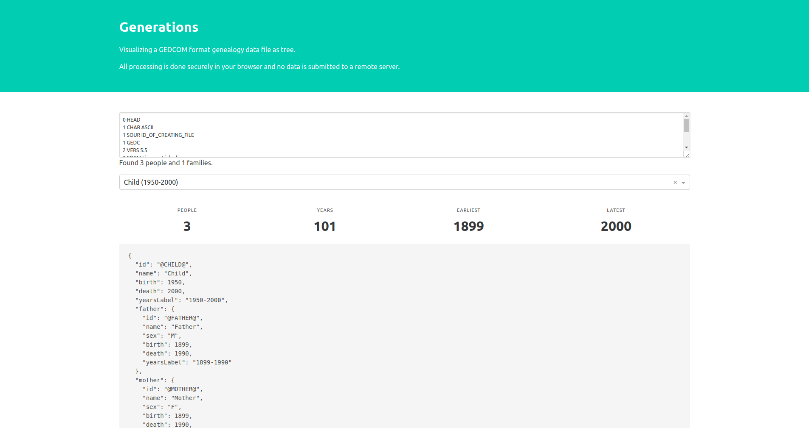

## Instructions

1. Clone this repository
2. Navigate to the folder containing this repository in your local file system
3. Run the following commands

```
npm install --save
npm start
```
4. Open [localhost:3000](http://localhost:3000) in your browser
5. Use your own GEDCOM file or a try a [demo file](http://heiner-eichmann.de/gedcom/simple.htm)
